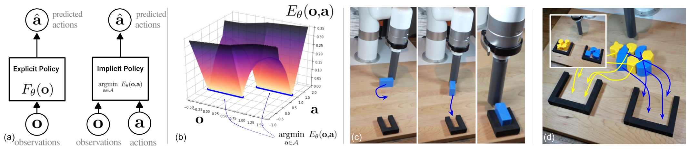
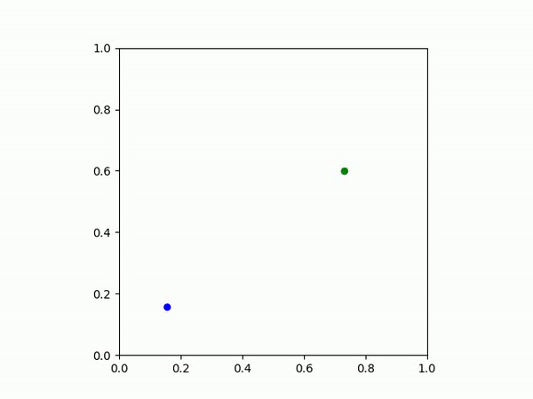
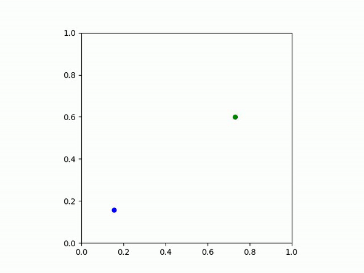

# Implicit Behavioral Cloning - PyTorch

Pytorch implementation of <a href="https://arxiv.org/abs/2109.00137">Implicit Behavioral Cloning</a>.

# Implicit Behavioral Cloning

This codebase contains the official implementation of the *Implicit Behavioral Cloning (IBC)* algorithm from our paper:


**Implicit Behavioral Cloning [(website link)](https://implicitbc.github.io/)  [(arXiv link)](https://arxiv.org/abs/2109.00137)** </br>
*Pete Florence, Corey Lynch, Andy Zeng, Oscar Ramirez, Ayzaan Wahid, Laura Downs, Adrian Wong, Johnny Lee, Igor Mordatch, Jonathan Tompson* </br>
Conference on Robot Learning (CoRL) 2021

  |  
:-------------------------:|:-------------------------:|



## Abstract

We find that across a wide range of robot policy learning scenarios, treating supervised policy learning with an implicit model generally performs better, on average, than commonly used explicit models. We present extensive experiments on this finding, and we provide both intuitive insight and theoretical arguments distinguishing the properties of implicit models compared to their explicit counterparts, particularly with respect to approximating complex, potentially discontinuous and multi-valued (set-valued) functions. On robotic policy learning tasks we show that implicit behavioral cloning policies with energy-based models (EBM) often outperform common explicit (Mean Square Error, or Mixture Density) behavioral cloning policies, including on tasks with high-dimensional action spaces and visual image inputs. We find these policies provide competitive results or outperform state-of-the-art offline reinforcement learning methods on the challenging human-expert tasks from the D4RL benchmark suite, despite using no reward information. In the real world, robots with implicit policies can learn complex and remarkably subtle behaviors on contact-rich tasks from human demonstrations, including tasks with high combinatorial complexity and tasks requiring 1mm precision.

## Install

```bash
pip install -e .
```

### Task: Particle

In this task, the goal is for the agent (black dot) to first go to the green dot, then the blue dot.

Example IBC policy  | Example MSE policy
:-------------------------:|:-------------------------:
  |   |

### Task: Block Pushing (from state observations)

Push the block to the given position.

### Task: pen-human
Rotate the pen by 90 degree.

## Dataset processing

#### Particle and Block-Pushing
For training the implicit bahavior cloning task "Particle" and "Block-Pushing", we generate data from scratch.
```
bash configs/particle/collect_data.sh
bash configs/pushing_states/collect_data.sh
```
The dataset will be stored in `data/ibcDataset` by default. Override the path by using the `--dataset_path` flag with the following command
```
python data/collect_policy.py --task=PARTICLE --num_episodes=200 --dataset_path=myPath
python data/collect_policy.py --task=PUSH --num_episodes=200 --dataset_path=myPath
```


#### D4RL
We preprocess the D4RL data into torch dataset by the following:

```
bash configs/d4rl/transform_d4rl_dataset.sh
```

## Maniskill Environments
### Dataset processing
First, you need to download raw demos from [maniskill Google Drive](https://drive.google.com/drive/folders/1QCYgcmRs9SDhXj6fVWPzuv7ZSBL94q2R), make sure to download both the h5 and json file!  

The demo is in `pd_joint_pos` control mode, but we need `pd_joint_delta_pos` for learning. So please use the control mode conversion tool provided by maniskill to process the demo files using script below. You should see two new files `trajectory.none.pd_joint_delta_pos.h5/.json`, these are the path that you need to pass in for next step.  
```bash
# Replay demonstrations with control_mode=pd_joint_delta_pos
cd YOUR_MANISKILL_DIR
CUDA_VISIBLE_DEVICES=0 python tools/replay_trajectory.py --traj-path YOUR_DEMO_PATH/trajectory.h5 \
  --save-traj --target-control-mode pd_joint_delta_pos --obs-mode none --num-procs 5
```
Note that for `Excavate-v0`, might need to add either `--allow-failure` or `--max-retry=5` to the end.  

After this, please run following script to generate training dataset. 
```bash
cd ibc_torch
CUDA_VISIBLE_DEVICES=0 python data/maniskill_full_pipeline.py \
--h5_path=CONVERTED_H5_FILE_PATH --json_path=CONVERTED_JSON_PATH \
--env_name=YOUR_ENV_NAME(e.g. Hang-v0) --raw_data_path=YOUR_NPY_DATA_PATH --dataset_path=YOUR_DATASET_PATH
```
Note that is providing --new_h5_path, the pipeline will store the new h5 file with a dict of ['observations', 'actions', 'rewards', 'terminals'].

When running this script, it should print you at first the `obs_dim` and `act_dim` for the env and demo. Record this and we will need them later in training and evaluation config file.  
Also, it should print to console replay success status for each trajectory in demo. Please let me know if there are a lot of False.

## Training
Both training and evaluation are configured using absl Flags. You can find sample training config file for ibc tasks and d4rl task under `configs`. You can find sample config file for maniskill env under `train/configs`. 

For the ManiSkill env training, there are a few changes that you might want to make:
- env_name: change it to the env name you are training
- dataset_dir: your dataset generated in last step
- obs_dim/act_dim: put the number previous script printed (predetermined in sample config for ibc task and d4rl)
- **visual_num_points**: 1024 for Hang-v0 and Excavate-v0, 704 for Fill-v0 (relavent to Maniskill env)
- data_amount: (Optional) use first x pairs of data in dataset
- exp_name: the experiment name for the training

Before running training, you might want to log in to wandb in your teminal first.
Note that the configs file for ibc task and d4rl are predetermined. You could start training with the following command:
### Particle
```
python train/train_agent.py --flagfile=configs/particle/particle_config.txt --exp_name=particle
```

### Block-pushing
```
python train/train_agent.py --flagfile=configs/pushing_states/blockpush_config.txt --exp_name=push
```

### D4RL
```
python train/train_agent.py --flagfile=configs/d4rl/pen_human_config.txt --exp_name=pen
```

### 
You could also modify any training config and start the training by the following:
```
python train/train_agent.py --flagfile=EVAL_CFG_FILE_PATH --exp_name=YOUR_EXP_NAME (and any other special configs)
```

The checkpoints will store in `work_dirs/formal_exp/{env_name}/{exp_name}`


### Evaluation
The sample eval config file for ibc task and d4rl is in `configs`.
Similar to training, you might want to make some modifications to the evaluation sample config file. 
Some evaluation arguments:
- train_exp_name: experiment name used in training. This should match what the --exp_name flag used in training
- eval_exp_name: experiment name used for evaluating
- max_episode_steps: 350 for Hang-v0, 250 for Fill-v0 and Excavate-v0
- dataset_dir: same dataset directory as training
- num_episodes: how many (random) seeds you want to evaluate your model on
- eval_step: (int) the checkpoint you want to evaluate
- compute_mse: (Optional, not available for ibc task and d4rl) add this argument if you want to compute mse to demo

Note that the configs file for ibc task and d4rl are predetermined. You could start training with the following command:
### Particle
```
python train/eval_agent.py --flagfile=configs/particle/eval_particle.txt --train_exp_name=particle --eval_exp_name=default
```

### Block-pushing
```
python train/eval_agent.py --flagfile=configs/pushing_states/eval_blockpush.txt --train_exp_name=push --eval_exp_name=default
```


### D4RL
```
python train/eval_agent.py --flagfile=configs/d4rl/pen_human_eval.txt --train_exp_name=pen --eval_exp_name=default
```
Note that to render video for d4rl, you may need to manully update the `envs/mojoco_env.py` under the `mjrl` package with the following:
```    
def render(self, *args, **kwargs):
        frame_size=(640,480)
        camera_name=None
        return self.sim.render(width=frame_size[0], height=frame_size[1],
                                             mode='offscreen', camera_name=camera_name, device_id=0)
```

### 
You could also modify any eval config and start the evaluating by the following:
```bash
CUDA_VISIBLE_DEVICES=0 python train/eval_agent.py --flagfile=EVAL_CFG_FILE_PATH --train_exp_name=YOUR_EXP_NAME_FOR_TRAINING --eval_exp_name=YOUR_EXP_NAME_FOR_EVAL
```

The evaluation output will store in `work_dirs/formal_exp/{env_name}/{train_exp_name}/eval/{eval_exp_name}`

### Trouble Shoot
All `CUDA_VISIBLE_DEVICES=x` are required, except for training. Maniskill softbody envs requires this.

